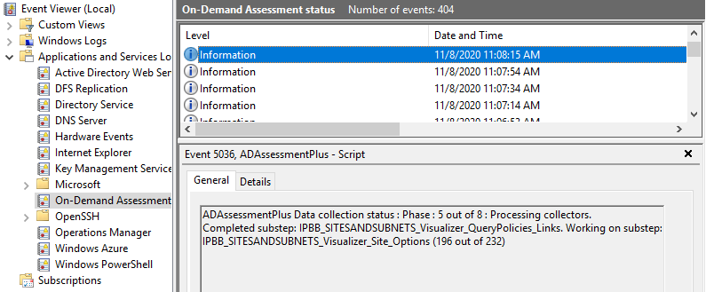
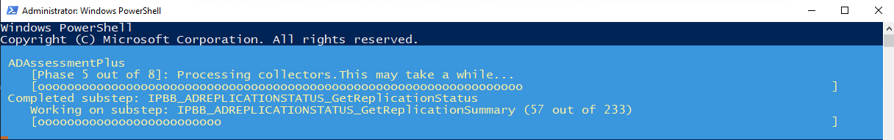

# AssessmentStatusTracking
This script helps troubleshoot and provide insights on the status on the On-Demand Assessments that are available as part of Microsoft Unified Support or Microsoft Premier Support (RAP as a Service).
For more information on On-Demand Assessments check the following site: https://docs.microsoft.com/en-us/services-hub/unified/health/getting_started_with_on_demand_assessments 

The Assessment-status-logging script provides insight in where the On-Demand assessment is with data collection or analysis. Since the assessment runs as a process it does not have a user interface that indicates what it is doing and possibly how long it will take to end.

This script allows you to track the assessment (when running) up to the end, it stops logging after the assessment generated the recommendation files that are uploaded to an Azure Log Analytixcs workspace. During collection and analasys we show where were are at (including collector and analyzer names and how many there are to complete in the current phase.

Run the script as Administrator. It requires the logging interval to be set. We suggest at minimum 120 seconds to avoid heavy logging, 30 minutes or 1800 seconds is recommended. If data collection usually takes two days, an interval of 3600 or even 7200 is recommended.

The script creates events logged under the Applications and Services Logs and generates an event at the chosen interval.

In the open PowerShell window, you will see a progress bar with the status logged.

This script is not replacing the Assessment troubleshooting script. 

If you end the script, it stops logging in Event Log as well. You have to restart it to track the progress again.

This script can be started any time after data collection is started, it requires the OMSAssessment.exe to be running.

In case multiple assessments run, it will prompt you for the one to track.
